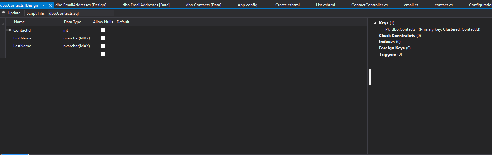
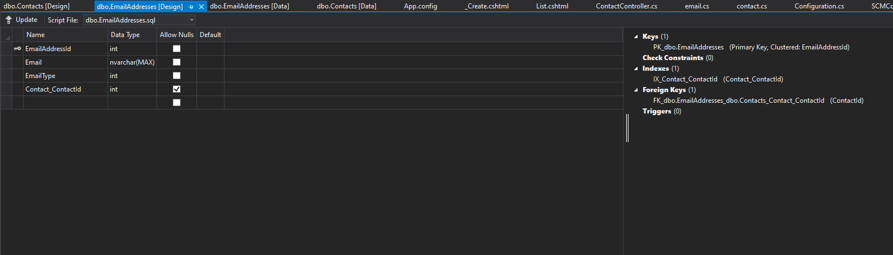
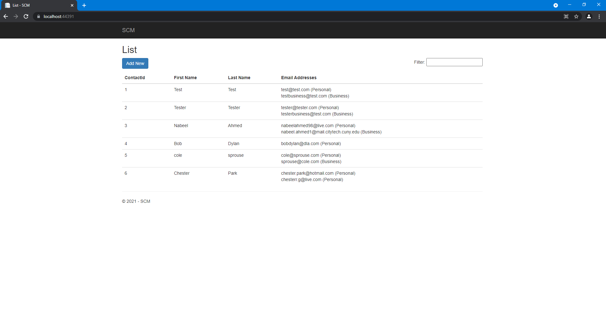
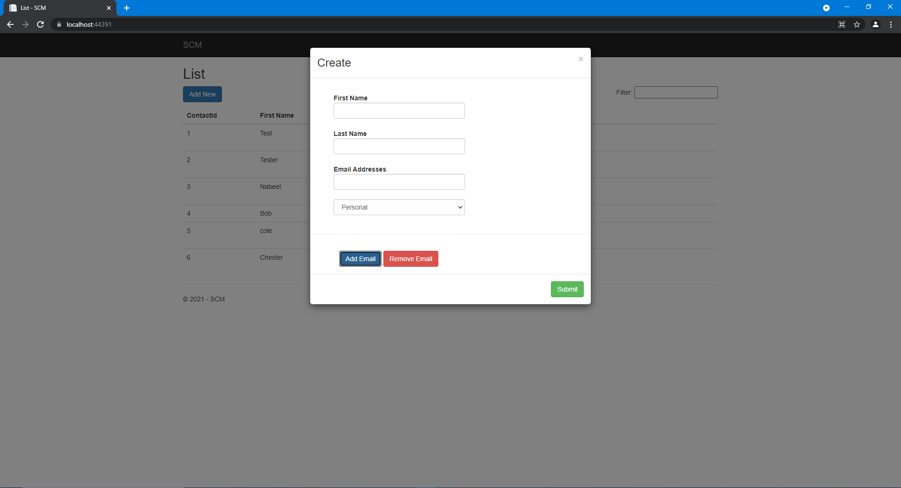
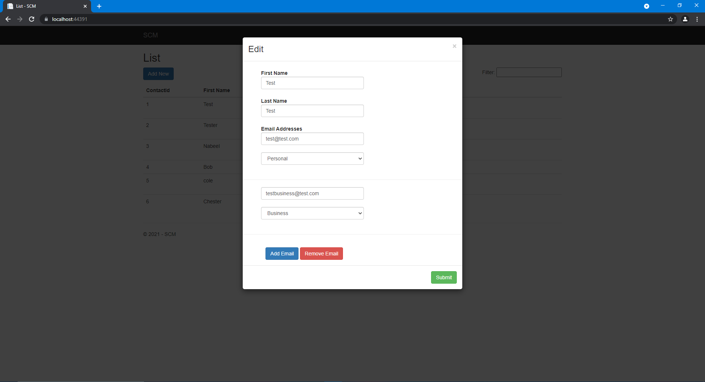
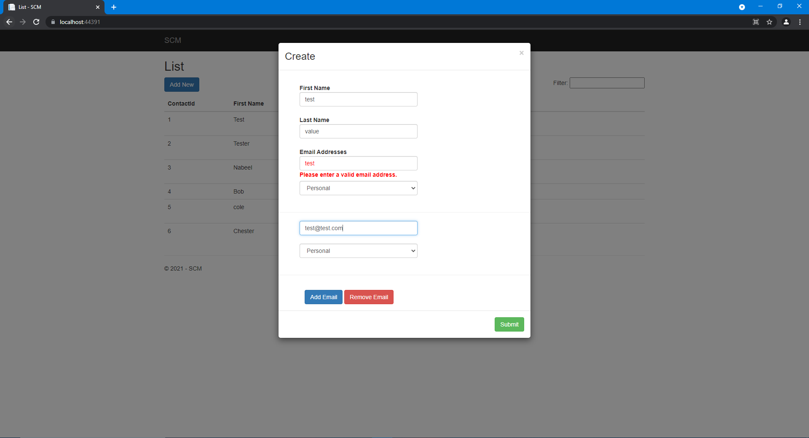

# SCM
A Simple Contact Manager 
## Summary
The Simple Contact Manager is a .Net Framework project that allows users to peruse Contact records, insert new Contact records,
and update existing ones.

The application is responsive, not requiring any full posts back to the controller, and has the following three views.
  1. List: This is the main page and from where all controls are accessed
  2. _Create: This is a partial view that houses the controls for the insert form
  3. _Edit: This is a partial view that houses the controls for the edit form

## Setup
To setup the application, first download, and open the project in visual studio. Within `SCM.Data` navigate to the `App.config` file.
Identify the following lines of code (Line 9-11)
```
  <connectionStrings>
    <add name="SCMContext" connectionString="server=(localdb)\MSSQLLocalDB;database=SCM;" providerName="System.Data.SqlClient" />
  </connectionStrings>
```
Replace the connectionString value based on what works for you. database value can remain the same, however server value should be one of the 
SQL Servers listed in the SQL Server Object Explorer in Visual Studio. (Access the Explorer from View, or by using Ctrl+\,Ctrl+S)

Next, Open up the Package Manager Console (navigate to Tools > NuGet Package Manager > Package Manager Console), switch the Default project to SCM Data, and run the following commands
```
enable-migrations
```
```
add-migration 'initialMigration'
```
```
update-database
```
The image below shows an example of the commands being run in the Package Manager Console.


Once the commands are run, the database will be set up, and two Contact records will be seeded in to the database. With the database set up, you can start the application.

## Database
The application has two tables from which records are accessed and inserted/updated. They are the following:
  1. Contact: A Contact Table housing user first and last name
  2. EmailAddress: An Email Address Table housing the email type (personal or business) and email address, along with the Contact Id the record is associated with.

Each Email Address can only be linked to one Contact record, while one Contact record can be linked to multiple Email Address records
The data table designs are as follows:
### Contact

### Email Address


## Application
### List
Once the application is run, the users are met with the Contacts list view. This is the main view, from which all actions are taken:

In this view, users see all of the Contact records currently in the database and their associated Email Addresses. There is a filter textbox in the top right corner of the table which takes user input and filters the data table in real-time to show only records that contain the user input somewhere in the row. For example, taking the above example, typing in "Nabeel" will filter out all rows and only show the third row.

In this view the following actions can be taken:
  1. Clicking 'SCM' navigates to the home page (although the home page is linked to this view)
  2. Clicking the 'Add New' button displays the Create pop-up modal, which allows users to insert a new record
  3. Double-clicking any row will display the Edit pop-up modal, which allows users to edit the selected record

### Create
The Create Partial View is a blank form with which users can insert new records:

In this partial view pop-up users can enter in the first, and last name. Furthermore, by clicking the 'Add Email' button, an Email Address control is generated to add an extra Email Address. Similarly clicking the 'Delete Email' will remove the most recent Email Address. Clicking 'Submit' will try to post the form and try inserting the record into the database.

### Edit
The Edit Partial View is a generated form with which users can edit the selected record:

Similar to the Create partial view, users can add more emails and remove existing emails. Furthermore, the Contact names can be altered. Clicking 'Submit' will try to post the form and try updating the record in the database.

### Validation
The Create and Edit forms have unobtrusive validation for the email address. Taking user input, the form tries to validate the input, and ensure that the email address follows the conventions of how email addresses are supposed to look:


